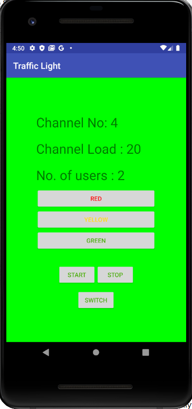
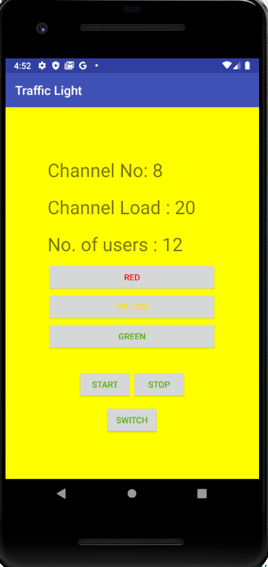
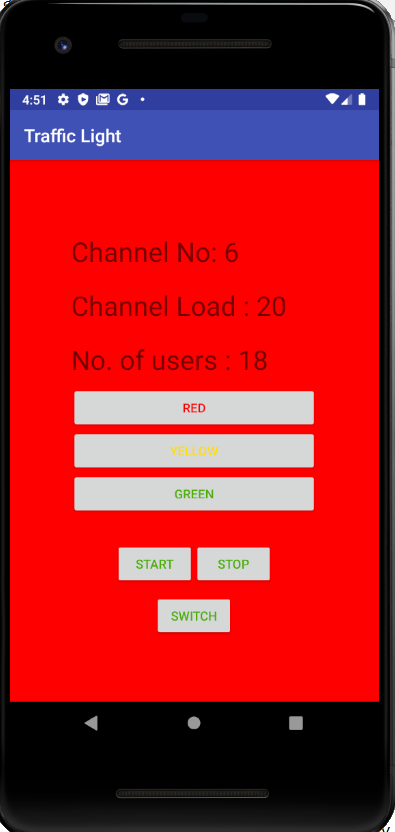

# WifiTraffic
A smart wifi project app, which tells a user about the crowd status(green, yellow, red) of the wifi access point. 

This app  was made for a smart wifi project, in which the purpose was to tell the users connected to a particular channel of a wifi access point to move to another acccess point near by, based on the status of particular wifi access point. 

The status of wifi access point is calculated by the number of users connected to channel and a demo was shown through 
WifiTraffic app (here, Traffic is referred as the traffic faced by one wifi access point). The three colors were used 
to decide the status, as mentioned below:

1. green - when the number of users are between 0 and 10. 
2. yellow - when the number of users are between 11 and 15. 
3. red - when the number of users are above 15. 

where the colors indicates:
1. green -  the particular channel of the access point is not crowded. 
2. yellow - the wifi access point is getting crowded and user need to search for access point nearby. 
3. red - the wifi access point is overcrowded, and users need to connect with another access point,
         otherwise the performance of the connection will degrade. 

Below are the screenshots of different colors displayed in WifiTraffic app based on the number of users:

1. green - when the number of users are between 0 and 10, it means the access point is not crowded. 

        

2. yellow - when the number of users are between 11 and 15, it means wifi access point is getting crowded 
and user need to search for access point nearby.

3. red - when the number of users are above 15, it means wifi access point is overcrowded, and users need to connect with another access point,
         otherwise the performance of the connection will degrade. 

